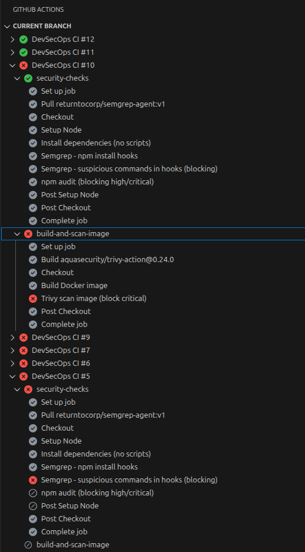
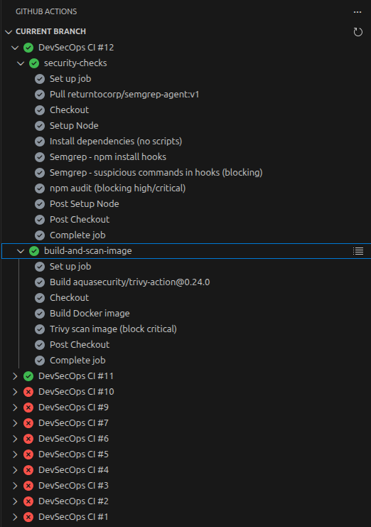
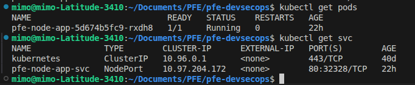
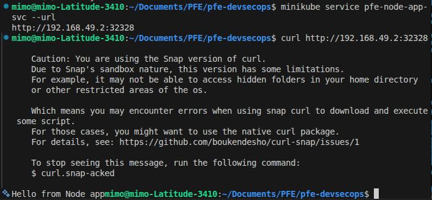

# 🔐 PFE – Sécurisation d’une Supply Chain npm (Node.js + CI/CD + Kubernetes)

## 🎯 Objectif du projet

Ce projet vise à comprendre et sécuriser une chaîne de développement moderne face aux attaques de type *software supply chain*, en particulier dans l’écosystème **npm**.

L’objectif est de traiter :

* les dépendances JavaScript téléchargées sans vérification approfondie,
* les scripts `postinstall` / `preinstall` exécutés automatiquement,
* les commandes système pouvant être dissimulées dans ces scripts,
* le risque lié aux nombreuses dépendances transitives et aux mainteneurs multiples.

> Comment empêcher qu’un code malicieux caché dans une dépendance npm soit exécuté et déployé automatiquement ?

Pour cela, j’ai mis en place une application Node.js simple, puis j’ai progressivement sécurisé toute la chaîne CI/CD jusqu’au déploiement Kubernetes.

---

# 🛠️ Outils utilisés et pourquoi

### Node.js

Pour simuler un projet réaliste utilisant npm et un grand nombre de dépendances.

### npm

Pour illustrer le fonctionnement des scripts d’installation (`postinstall`, `preinstall`) qui peuvent exécuter du code automatiquement.

### GitHub Actions

Pour automatiser les contrôles de sécurité à chaque push.

### Semgrep

Pour détecter :

* la présence de hooks npm (`postinstall`, `preinstall`)
* l’utilisation de commandes système suspectes dans ces scripts

Cela permet de traiter des comportements malveillants **même sans CVE déclarée**.

### npm audit

Pour identifier les vulnérabilités connues (CVE).

### Docker

Pour construire une image reproductible et contrôler précisément l’environnement d’exécution.

### Trivy

Pour scanner l’image Docker (OS + librairies).

### Kubernetes (Minikube)

Pour valider le déploiement final dans un environnement proche de la production.

---

# 🧠 Ce que le projet démontre

* Une dépendance npm peut exécuter du code automatiquement lors de l’installation.
* Un simple `npm audit` peut ne rien détecter alors qu’un comportement suspect existe.
* Un projet npm peut embarquer des dizaines voire centaines de dépendances indirectes.
* Une compromission d’un maintainer peut impacter toute la chaîne.

La sécurité doit donc être intégrée dès la CI, pas seulement au moment du déploiement.

---

# ⚠️ Étape 1 – Simulation d’une menace Supply Chain

J’ai créé une application Node.js minimale.

Ensuite, j’ai ajouté une dépendance locale volontairement malveillante (`evil-lib`) contenant un script `postinstall`.

Ce script s’exécutait automatiquement lors du `npm install`, sans action explicite du développeur.

Ce comportement :

* ne déclenchait aucune CVE,
* n’était pas détecté par un simple `npm audit`,
* s’exécutait automatiquement au moment de l’installation.


---

# 🛑 Étape 2 – Mise en place des contrôles CI

J’ai intégré des règles Semgrep afin de détecter :

* les scripts `postinstall`, `preinstall`
* les commandes système suspectes (`sh`, `bash`, `curl`, etc.)

Le pipeline est configuré en mode *fail fast* :

Si un comportement à risque est détecté → la chaîne s’arrête immédiatement.

### Exemple de blocage



---

# 🟢 Étape 3 – Pipeline stabilisé

Après correction :

* dépendances propres
* lockfile cohérent
* suppression du comportement suspect
* règles adaptées

Le pipeline passe entièrement.



---

# 🐳 Étape 4 – Sécurisation du build Docker

Problème rencontré :

Même sans vulnérabilité dans mon application, Trivy détectait des CVE issues du npm embarqué dans l’image `node:20-alpine`.

Cela montre que la surface d’attaque ne se limite pas au code applicatif.

Solution :

* utilisation de `npm ci --ignore-scripts`
* suppression de npm/npx après installation
* réduction de la surface d’attaque runtime

Le build devient reproductible et plus sécurisé.

---

# 🔎 Étape 5 – Scan d’image avec Trivy

L’image Docker est analysée :

* vulnérabilités OS
* vulnérabilités librairies

Le pipeline bloque automatiquement en cas de vulnérabilité élevée ou critique.

Après durcissement de l’image, le scan passe avec succès.

---

# ☸️ Étape 6 – Déploiement Kubernetes

Les manifests Kubernetes ont été adaptés pour l’application Node :

* Deployment
* Service NodePort
* Readiness & Liveness probes

Déploiement validé :



Application accessible :



---

# 📚 Ce que j’ai appris

* Une dépendance peut exécuter du code automatiquement via un hook npm.
* L’absence de CVE ne signifie pas absence de risque.
* La supply chain npm implique souvent des dépendances transitives invisibles.
* La sécurité doit être intégrée dès la CI.
* Docker runtime ≠ environnement de build.
* Les images officielles peuvent embarquer des dépendances vulnérables.
* Kubernetes doit être conditionné aux contrôles CI.

---

# 🚀 Architecture finale

```
Développeur
   ↓
GitHub
   ↓
CI (Semgrep + npm audit)
   ↓
Build Docker sécurisé
   ↓
Scan Trivy
   ↓
Déploiement Kubernetes
```

Chaque étape bloque la suivante si un problème est détecté.

---

# 📌 Limites et améliorations possibles

* Génération d’un SBOM (Software Bill of Materials : liste complète des dépendances utilisées par l’application afin de savoir exactement quels composants sont présents et pouvoir identifier rapidement les vulnérabilités)
* Signature des images Docker (permet de garantir l’authenticité d’une image Docker et de vérifier qu’elle n’a pas été modifiée ou remplacée par une image malveillante avant son déploiement)

---

# ✅ Conclusion

La chaîne complète est maintenant :

* automatisée
* reproductible
* sécurisée
* bloquante en cas de menace
* déployée avec succès sur Kubernetes

Ce projet montre concrètement comment traiter les risques liés aux dépendances npm, aux scripts d’installation automatiques et à la supply chain logicielle dans une approche DevSecOps cohérente.

